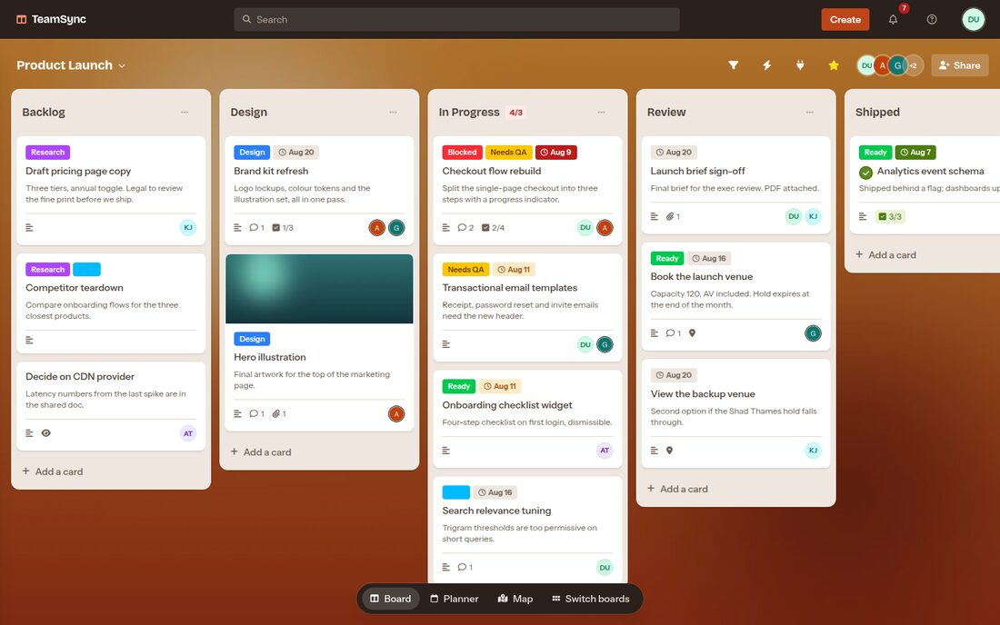
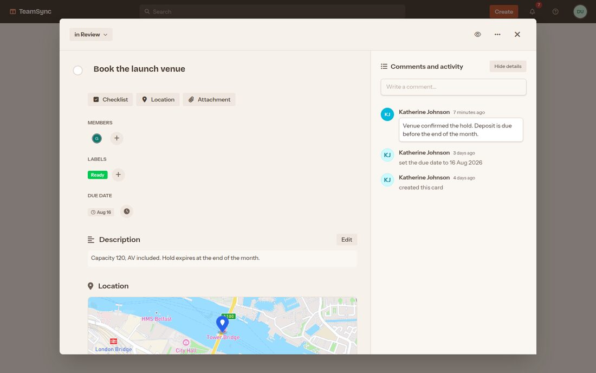
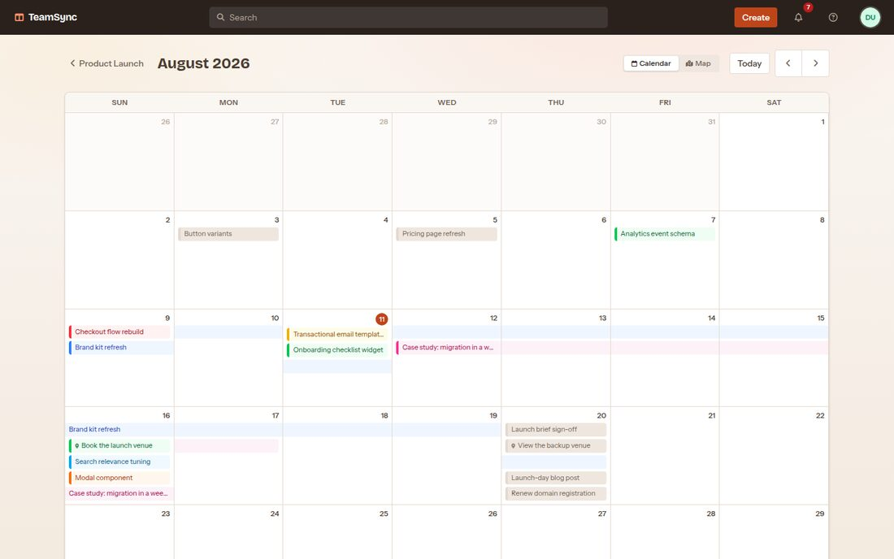
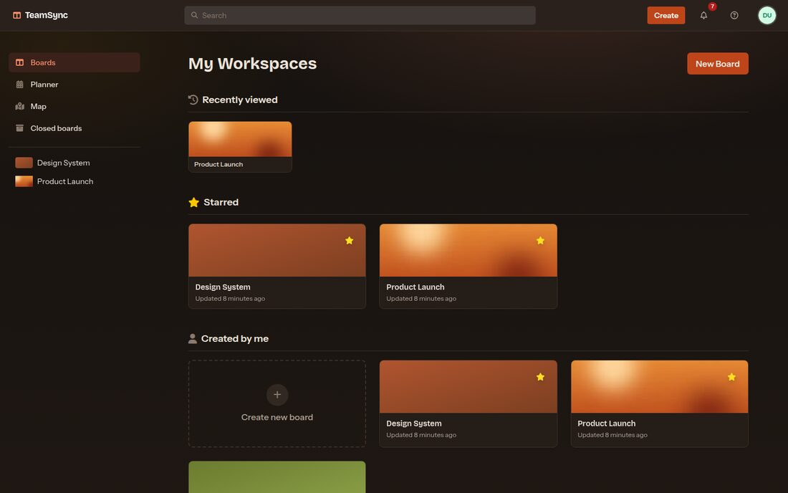

# TeamSync

A Trello-style project board app for small teams: boards, lists, and cards, with
labels, due dates, checklists, attachments, and comments, all kept in sync live
across everyone looking at the same board. Built with Rails 7.1, Hotwire (Turbo +
Stimulus), Tailwind CSS v4, and PostgreSQL.



## Features

### Boards

- Custom cover — an uploaded photo or a deterministic generated gradient.
- Favoriting/starring, a "recently viewed" list, and closing/reopening a board
  (closing hides it from the default views; it isn't made read-only).
- Copying a board — lists, active cards, labels, and members carry over.
- Board-wide activity feed, a map of every located card, and full-text search
  across boards and cards.
- Adding a member looks up an **existing** user by their exact email and
  attaches them directly — there's no invitation email or signup flow for a
  non-user, and the added person gets no notification about it.
- Owner vs. member: only the board's creator can close, reopen, delete it, or
  manage its member list. Any member can otherwise use the board fully — cards,
  lists, labels, and comments have no further role distinction.

### Lists

- Drag-and-drop reordering, an advisory (non-blocking) WIP/card limit per list,
  one-time sort by due date/title/newest, archive-all-cards, and copying a list
  within the same board.

### Cards

- Labels, multiple members per card, due date **and** a separate start date
  (together driving date ranges in the Planner), checklists with progress bars,
  file attachments (with an automatic cover image from the first image
  attached), and a location that plots the card on a map.
- Comments with **@mentions** (typeahead against the board's members), merged
  live with a per-card activity log (moves, renames, due-date changes,
  completions, and more).
- Archive/restore, copying a card to another list, inline title editing, and
  drag-and-drop between lists.
- **Watching**, separately from being a member: both boards and individual
  cards can be watched, widening who gets notified without adding you as a
  member.



### Notifications

Nine notification types (comments, @mentions, added/removed as a card member,
due-soon, moves/archives/attachments on watched cards, new cards on watched
boards), each independently toggleable in account settings. Unread count shows
as a live badge in the top nav, kept in sync over Action Cable without a
page reload.

### Planner and map

- A monthly **calendar grid** and a separate **agenda** list view, both showing
  every card with a due or start date across all of your boards; multi-day
  cards render as a single spanning bar rather than a chip per day.
- A cross-board **map** view (and a per-board one) plotting every card that has
  a location set.



### Everything else

- **Keyboard shortcuts** with a discoverable help overlay (`?`) — quick search
  focus, filtering, moving focus between cards, opening the focused card, and
  more.
- **Light / dark / "match system" theming**, resolved server-side so there's no
  flash of the wrong theme on load.
- **Real-time multi-user sync** over Action Cable: card moves, list edits, new
  comments, activity entries, and the notification badge all update live for
  every other viewer of the same board.



## Stack and architecture

- **Rails 7.1**, PostgreSQL.
- **Hotwire** — Turbo Drive/Frames/Streams for navigation and live updates,
  Stimulus for the rest of the client-side behavior. No SPA framework.
- **importmap-rails**, no Node build step. JavaScript dependencies (Stimulus,
  SortableJS, TipTap, etc.) are pinned and vendored into the repo rather than
  fetched from a CDN at runtime.
- **Tailwind CSS v4**, CSS-first configuration (`app/assets/tailwind/application.css`)
  via `tailwindcss-rails` — no `tailwind.config.js`.
- **Active Storage** for uploads, backed by **Cloudinary** in development and
  production (disk storage in tests).
- **Solid Queue** for background jobs (the due-date reminder scan), **Devise**
  for authentication, **Action Cable** (Postgres adapter) for broadcasts.

## Getting started

### Prerequisites

- Ruby 3.3.5
- PostgreSQL

That's it — there's no Node.js/Yarn/npm dependency. JavaScript ships via
importmap and vendored files already committed to the repo, and Tailwind's CLI
comes bundled with the `tailwindcss-rails` gem.

### Setup

```bash
git clone <repo-url>
cd team_sync
bundle install
bin/rails db:prepare
bin/rails db:seed
bin/dev
```

`bin/dev` runs the Rails server and Tailwind's watcher together. If CSS
changes don't show up live, Tailwind's watch mode depends on a file-watching
backend (e.g. `watchman`) that may not be installed on your system — run
`bin/rails server` and `bin/rails tailwindcss:build` separately in that case,
rebuilding after each CSS-affecting change.

Seeding populates five boards covering every feature above — labels, members,
checklists, attachments, comments with mentions, notifications, a closed
board, an archived card — so a fresh install has something real to click
through immediately, not an empty shell.

**Sign in as `demo@example.com` / `password`** once seeded. (Every seeded user
shares that password — see `db/seeds.rb` for the full list.)

## Testing

The unit/integration suite (models, controllers, helpers) runs under minitest:

```bash
bin/rails test
```

The system suite drives a real headless Chrome via Capybara + Selenium, and
runs separately:

```bash
bin/rails test:system
```

**Known issue, not a regression you caused:** the system suite has a
documented, intermittent flake where a driven interaction (a click, a form
submit) occasionally produces no effect at all — no error, no request, nothing
in the DOM. It isn't specific to one test; historically it's affected roughly
1-in-5 to 1-in-2 full-suite runs. The investigation, the mechanism ruled out
(and the one that wasn't), and the retry-and-measure primitive built around it
are all documented directly in `test/application_system_test_case.rb` and
`test/support/`. If a system test fails in a way that looks like "nothing
happened," re-run before assuming you broke something.

## Deployment

See **[`docs/deploy.md`](docs/deploy.md)** for the full checklist — environment
variables and where each value comes from, an external-Postgres setup, and a
post-deploy verification list.

One deliberate trade-off worth knowing up front: the Solid Queue **worker
service is commented out** in `render.yaml`, because it's a paid Render
instance and that cost hasn't been approved. Without it, due-date reminder
notifications don't fire in production — everything else works. Re-enabling it
is a matter of uncommenting that block once you're ready to pay for it.

## Notable engineering decisions

**Theming by token redefinition, not utility variants.** Dark mode doesn't add
`dark:` classes anywhere — it redefines the same `@theme` token *values* under
`[data-theme="dark"]`, so every existing `bg-surface-0`/`text-ink-700`/etc.
utility already in use flips automatically. "Match system" is a plain CSS
`prefers-color-scheme` media query, resolved with no JavaScript and no
first-paint flash; the theme switcher only ever writes a preference, it never
resolves "system" itself.

**Conventions enforced by tests, not documentation.** A handful of app-wide
rules are guarded by dedicated tests rather than a style guide someone has to
remember to check: no raw color in views/JS outside the token system
(`NoRawColourInViewsTest`), no baked opacity on a token that's supposed to
theme (`NoBakedAlphaOnThemedTokensTest`) — both in
`test/integration/theme_tokens_test.rb` — a `turbo_stream.replace` can't target
a frame that doesn't re-emit itself (`test/integration/frame_replace_targets_test.rb`),
every notification action has a matching user preference
(`test/integration/notification_coverage_test.rb`), dropdowns carry the ARIA
attributes a real disclosure widget needs (`test/integration/dropdown_aria_test.rb`),
and z-index values come from one named ladder, never an arbitrary one-off
(`test/integration/z_index_layers_test.rb`).

**A single broadcast convention.** Actions that change shared state (a card
move, a completed checklist item) broadcast the result to everyone watching
that stream — including the person who took the action, since they're
subscribed to it too — and the actor's own HTTP response renders nothing
(`head :ok`/`:no_content`). The one wrinkle: broadcast partials are rendered
with no session at all, so anything per-viewer (like whether *you* are
watching a card) can't be baked into that shared HTML — it's revealed
client-side instead, checked against the current user after the partial
lands.

**Cloudinary-native transform URLs where possible.** When an attachment's
underlying blob is stored on Cloudinary, image URLs are built directly with
Cloudinary's own transformation syntax rather than Rails generating and
processing an Active Storage variant — cheaper and faster, since Cloudinary
already does the resizing. Non-Cloudinary storage (disk, used in tests) falls
back to ordinary Active Storage variants, so the app works the same way in
both cases.

## Known limitations

- **No invitation flow** — adding a board member requires them to already have
  an account under that exact email; nothing else acknowledges the addition.
- **No outgoing email in production** until SMTP is configured — password
  reset and other Devise mail will raise rather than pretend to send.
- **Due-date reminders don't fire** until the (paid) background worker is
  enabled — see Deployment above.
- **No per-board roles** — every member has the same permissions on a board
  they belong to; only the owner is distinguished, and only for
  closing/reopening/deleting the board and managing its members.
- **Closed boards are hidden, not locked** — closing a board removes it from
  the default views but doesn't prevent edits to its cards or lists if you
  still have the URL.
- **The planner's calendar grid has no minimum column width** — on a narrow
  phone screen its seven day-columns keep shrinking with the viewport, and due
  chips get cramped and truncate well before the layout actually breaks.
- **Board- and list-level changes don't appear in the activity feed** —
  `Activity` records are attached to a card, not a board or list, so renaming
  a list or closing a board leaves no trace there; only things that happen
  *to a card* are logged.

## Linting

```bash
bundle exec rubocop
```
